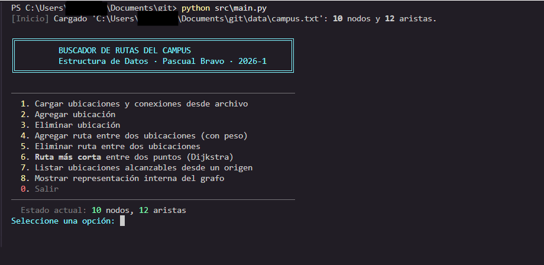
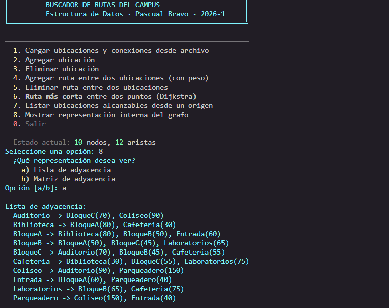
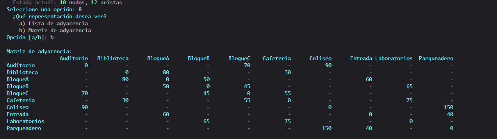
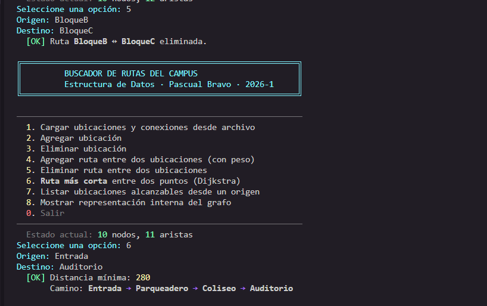
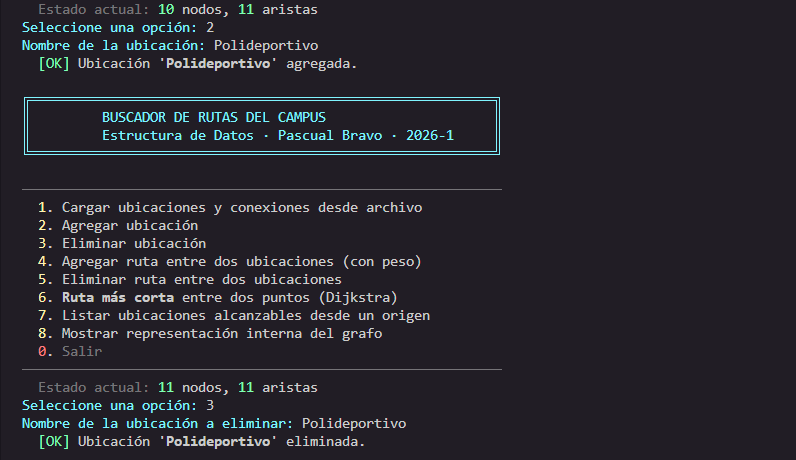

# Buscador de Rutas del Campus

Aplicación de consola en Python que modela un campus universitario como un **grafo no dirigido y ponderado** y permite calcular rutas más cortas, gestionar ubicaciones, listar puntos alcanzables desde un origen y visualizar la estructura interna del grafo.

Combina dos estructuras de datos vistas en clase:

- **Grafo** representado con lista de adyacencia.
- **Arreglos** auxiliares (listas y diccionarios) para Dijkstra y DFS.

## Información académica

| | |
|---|---|
| **Asignatura** | Estructura de Datos |
| **Institución** | Institución Universitaria Pascual Bravo |
| **Programa** | Ingeniería de Software |
| **Período** | 2026‑1 |
| **Problema escogido** | Problema 1 — Buscador de rutas del campus |

## Integrantes

| Nombre | Aporte principal |
|---|---|
| Sara Ríos Vélez | Modelado del grafo, casos de prueba y documentación |
| Ader Eliecer Quintana Herrera | Algoritmo Dijkstra, DFS de alcanzables y menú interactivo |

> Repositorio en GitHub: <https://github.com/AderDevP/buscador-rutas-campus>

## Estructura del repositorio

```
.
├── README.md
├── .gitignore
├── src/
│   ├── grafo.py        # Clase Grafo + Dijkstra + alcanzables + carga desde archivo
│   └── main.py         # Menú interactivo y punto de entrada
├── data/
│   └── campus.txt      # Datos de ejemplo del campus
└── docs/
    ├── documento_tecnico.md
    └── diagrama_grafo.txt
```

## Requisitos

- Python 3.9 o superior
- Sistema operativo Windows, Linux o macOS
- No requiere librerías externas (solo `heapq`, `math`, `os`, `typing` de la stdlib)

## Cómo clonar y ejecutar

```bash
git clone https://github.com/AderDevP/buscador-rutas-campus.git
cd buscador-rutas-campus
python src/main.py
```

> En Windows con `cmd`, la separación de rutas es con `\`: `python src\main.py`.

Al iniciar, el programa lee automáticamente `data/campus.txt` y muestra el menú. Si el archivo no existe, arranca con un grafo vacío.

## Guía de uso del menú

Al ejecutar verás:

```
============================================================
   BUSCADOR DE RUTAS DEL CAMPUS
============================================================
 1. Cargar ubicaciones y conexiones desde archivo
 2. Agregar ubicación
 3. Eliminar ubicación
 4. Agregar ruta entre dos ubicaciones (con peso)
 5. Eliminar ruta entre dos ubicaciones
 6. Calcular ruta más corta entre dos puntos (Dijkstra)
 7. Listar ubicaciones alcanzables desde un origen
 8. Mostrar representación interna del grafo
 0. Salir
------------------------------------------------------------
```

A continuación, qué hace cada opción y qué te pide.

### 1) Cargar ubicaciones y conexiones desde archivo

- **Para qué sirve:** reemplazar el grafo en memoria por uno leído de un `.txt`.
- **Pide:** ruta del archivo (Enter para usar `data/campus.txt`).
- **Salida típica:** `[OK] Cargado: 10 nodos y 12 aristas.`

Formato del archivo:

```
# Comentario
NODO BloqueA
NODO BloqueB
ARISTA BloqueA BloqueB 50
```

### 2) Agregar ubicación

- **Para qué sirve:** registrar un nuevo punto del campus.
- **Pide:** nombre del nodo.
- **Errores controlados:** nombre vacío, ya existe.

### 3) Eliminar ubicación

- **Para qué sirve:** quitar un punto del campus.
- **Pide:** nombre del nodo.
- **Efecto colateral:** se eliminan **todas** las aristas que tocaban ese nodo.

### 4) Agregar ruta entre dos ubicaciones (con peso)

- **Para qué sirve:** registrar un camino transitable bidireccional.
- **Pide:** origen, destino, peso (m o s).
- **Reglas:** peso `≥ 0`, `origen ≠ destino`. Si los nodos no existen, los crea. Si la arista ya existía, **actualiza** el peso.

### 5) Eliminar ruta entre dos ubicaciones

- **Para qué sirve:** cerrar un camino entre dos puntos.
- **Pide:** origen, destino.
- **Efecto:** los nodos siguen existiendo, pero pierden la conexión directa.

### 6) Calcular ruta más corta (Dijkstra)

- **Para qué sirve:** encontrar la ruta de menor peso entre dos puntos.
- **Pide:** origen, destino.
- **Salida típica:**

  ```
  [OK] Distancia mínima: 225
       Camino: Entrada -> BloqueA -> BloqueB -> BloqueC -> Auditorio
  ```

- Si no existe ruta: `[!] No hay ruta entre 'X' y 'Y'.`

### 7) Listar ubicaciones alcanzables desde un origen

- **Para qué sirve:** ver qué partes del campus están conectadas (componente conexo).
- **Pide:** origen.
- **Algoritmo:** DFS iterativo con pila.

### 8) Mostrar representación interna del grafo

- **Para qué sirve:** inspeccionar la estructura de datos.
- **Sub‑opciones:**
  - `a` Lista de adyacencia (estructura real que se usa internamente).
  - `b` Matriz de adyacencia (tabla `V × V`, derivada al vuelo).

### 0) Salir

- Cierra el programa. Los cambios hechos en memoria no se persisten.

## Capturas de la aplicación

> Todas las imágenes están en `docs/imagenes/`.

### Menú principal



### Opción 8a — Lista de adyacencia



### Opción 8b — Matriz de adyacencia



### Opción 6 — Ruta más corta (Dijkstra)


### Opción 7 — Alcanzables desde un origen


### Opción 5 + Opción 6 — Eliminar ruta y recalcular



### Opciones 2 y 3 — Agregar y eliminar ubicación



## Demo guiada (recorrido típico)

```
1) python src\main.py
   → Cargados 10 nodos y 12 aristas desde data/campus.txt.

2) Opción 8 → a
   → Inspeccionas la lista de adyacencia.

3) Opción 6
   Origen: Entrada
   Destino: Auditorio
   → Distancia mínima: 225
     Camino: Entrada -> BloqueA -> BloqueB -> BloqueC -> Auditorio

4) Opción 5
   Origen: BloqueB
   Destino: BloqueC
   → [OK] Ruta eliminada.

5) Opción 6 (recálculo automático)
   Origen: Entrada
   Destino: Auditorio
   → Distancia mínima: 280
     Camino: Entrada -> Parqueadero -> Coliseo -> Auditorio
   ↳ Dijkstra rodea el corte por el Coliseo.

6) Opción 7
   Origen: Entrada
   → 9 ubicaciones alcanzables.

7) Opción 0 → salir.
```

## Datos de ejemplo (`data/campus.txt`)

10 ubicaciones genéricas y 12 conexiones con pesos en metros. Se puede modificar libremente respetando el formato del archivo.

```
NODO Entrada
NODO BloqueA
...
ARISTA Entrada BloqueA 60
ARISTA BloqueA BloqueB 50
...
```

## Documento técnico

El detalle del modelado, complejidades, casos de prueba y trazas paso a paso se encuentra en [`docs/documento_tecnico.md`](docs/documento_tecnico.md).

## Limitaciones conocidas

- Grafo **no dirigido**: no soporta calles de un solo sentido.
- Pesos **no negativos** (Dijkstra los exige).
- Sin persistencia automática: los cambios en memoria se pierden al salir.
- Interfaz **solo por consola**.

## Licencia

Uso académico — Institución Universitaria Pascual Bravo, 2026‑1.
